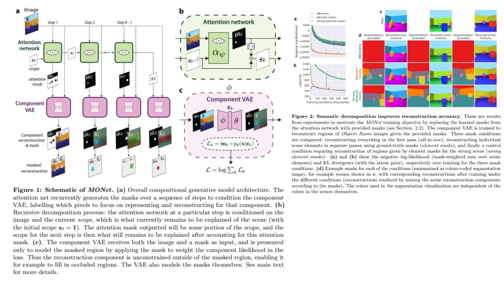

# 💐 MONet-Replication – Modular Object-Centric Learning

This repository provides a **PyTorch-based replication** of  
**MONet: Unsupervised Scene Decomposition and Representation**.

The goal is to **understand and implement object-centric representation learning**  
through recurrent attention and component-wise VAEs — not to chase SOTA numbers.

- Decomposes scenes into **interpretable object slots** 🧿  
- Uses **recurrent attention** to segment objects sequentially 🌀  
- Learns **disentangled latent representations** per object 🧬  
- Fully modular and easy to plug into vision research pipelines ⚙️  

**Paper reference:** [MONet – Burgess et al., 2019](https://arxiv.org/abs/1901.11390) 📄

---

## 🌌 Overview – MONet Pipeline



MONet decomposes an image into a set of object-centric latent variables by iteratively attending to different regions of the scene.

Core idea:

> Sequentially attend to different parts of the image, encode each region with a VAE, and reconstruct the scene by softly composing object reconstructions.

High-level process:

1. Extract image features using a CNN encoder.
2. Generate an attention mask using a recurrent attention network.
3. Encode the masked region into a latent variable.
4. Decode each latent into an object reconstruction.
5. Soft-compose all object reconstructions into the final image.

---

## 🔍 Model Structure

The model consists of two main components:

### 1. Recurrent Attention Network

Generates a sequence of soft masks that decompose the image into object regions.

At step $k$:

$$
m_k = \alpha_\psi(x, s_{k-1})
$$

Where:
- $m_k$ is the attention mask
- $\alpha_\psi$ is the attention network
- $s_{k-1}$ is the remaining unexplained scope

The scope is updated as:

$$
s_k = s_{k-1} \cdot (1 - m_k)
$$


### 2. Component-wise VAE

Each mask is used to encode and decode a single object:

Encoder:

$$
q_\phi(z_k | x, m_k)
$$

Decoder:

$$
p_\theta(x_k | z_k)
$$

Reconstruction is performed via soft composition:

$$
\hat{x} = \sum_k m_k \cdot x_k
$$

---

## 🧮 Training Objective – MONet ELBO

The full model is trained by maximizing the Evidence Lower Bound:

```math
\mathcal{L} =
\sum_k \mathbb{E}_{q_\phi(z_k \mid x, m_k)}[\log p_\theta(x \mid z_k, m_k)]
- \beta \, \mathrm{KL}(q_\phi(z_k \mid x, m_k) \Vert p(z_k))
+ \lambda \, \mathcal{L}_{mask}
```

Where:
- Reconstruction likelihood is Gaussian
- Prior $p(z)$ is standard normal
- Mask loss enforces partitioning consistency
- $\beta$ controls disentanglement strength

---

## 🧠 What the Model Learns

- Object-centric latent slots instead of global embeddings  
- Unsupervised segmentation through attention  
- Disentangled representations per object  
- Scene decomposition without labels  

This makes MONet a foundation model for:
- Object-based reasoning  
- Compositional generalization  
- Interpretable vision systems  

---

## 📦 Repository Structure

```bash
MONet-Replication/
├── src/
│   ├── encoder/
│   │   ├── cnn_encoder.py         # Image → feature map
│   │   └── mask_encoder.py        # (Image, Mask) → latent posterior params
│   │
│   ├── attention/
│   │   ├── attention_net.py       # αψ(x, scope) → attention logits
│   │   ├── scope_update.py        # Recursive scope logic
│   │   ├── mask_generator.py      # mk generation step-by-step
│   │   └── recurrent_attention.py # Full MONet attention loop
│   │
│   ├── vae/
│   │   ├── encoder.py             # qφ(z_k | x, m_k)
│   │   ├── decoder.py             # pθ(x | z_k)
│   │   ├── mask_decoder.py        # pθ(c | {z_k})
│   │   └── component_vae.py       # One masked VAE forward
│   │
│   ├── decoder/
│   │   └── compositor.py          # Σ_k m_k * x_k
│   │
│   ├── model/
│   │   └── monet.py               # Full MONet forward pipeline
│   │
│   ├── loss/
│   │ 	└── monet_loss.py   		 # Full MONet ELBO
│   │
│   └── config.py                   # slots, latent_dim, image_size
│
│
│
├── images/
│   └── figmix.jpg               # MONet overview figure
│
├── requirements.txt
└── README.md
```
---


## 🔗 Feedback

For questions or feedback, contact: [barkin.adiguzel@gmail.com](mailto:barkin.adiguzel@gmail.com)
